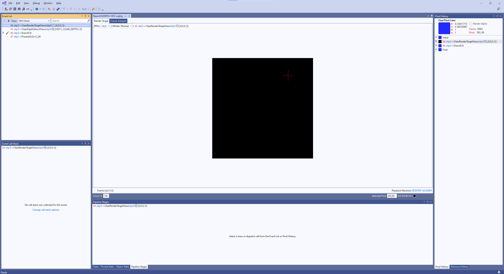
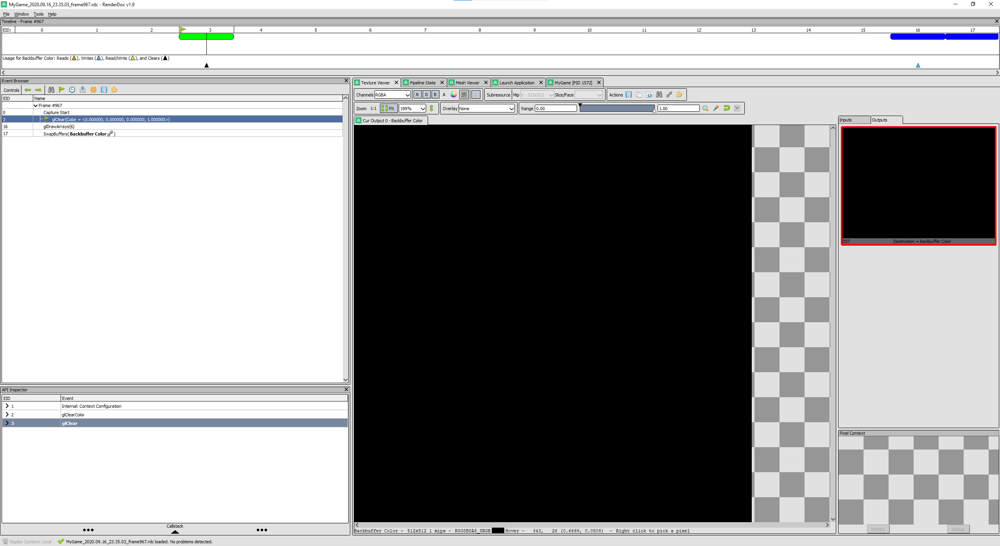
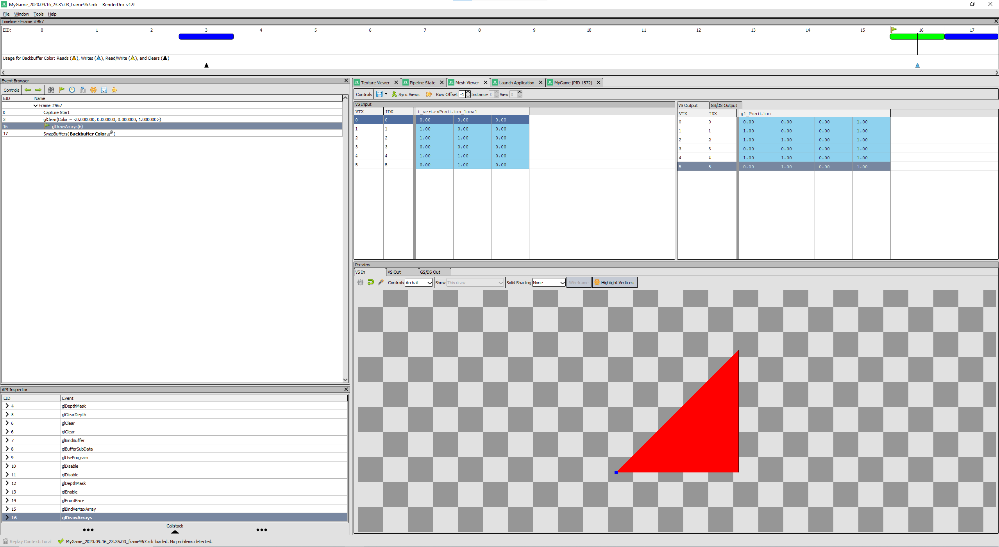

## Assignment 02 Write-up

### Downloads:
[MyGame_x86](https://github.com/XingnanChen/Engineer2/raw/master/Assignment02/MyGame_x86.zip)  
[MyGame_x64](https://github.com/XingnanChen/Engineer2/raw/master/Assignment02/MyGame_x64.zip)  

### Assignment Objectives：
1. Learn about platform-specific and platform-independent implementation.
2. Encapsulate mesh and shader functions into classes.
3. Setup GPU debugger

### ScreenShots 
Animation  
  
 

### Implementation:
1. Create a mesh class and extract the mesh functions from graphics.[platform].cpp.  
    Taking graphics.d3d.cpp as example：  
    a.Create a class called cMesh.There will be cMesh.h and cMesh.cpp. Change cMesh.cpp to cMesh.d3d.cpp.  
    b.Find Geometry Data in graphics.d3d.cpp and put those two variables into cMesh.d3d.cpp.  
    c.Find all the mesh functions(Draw&Initialize&Cleanup) and put them into cMesh.d3d.cpp.  

2. Create a shader class and extract the shader functions from graphics.[platform].cpp.(Bind&Initialize&Cleanup).  
    Specific steps are the same as creating the mesh class.
3. Replace the code in graphics with mesh and shader class.
```cpp
    s_mesh.draw();
    s_effect.bind();
```
4. Add another triangle to mesh. Add the triangle count from 1 to 2. Then add three vertices to the vertex array.
5. GPU debugger  
    a.Direct3D GPU capture  
        
        
      
    b.OpenGL GPU capture  
        
        
      
