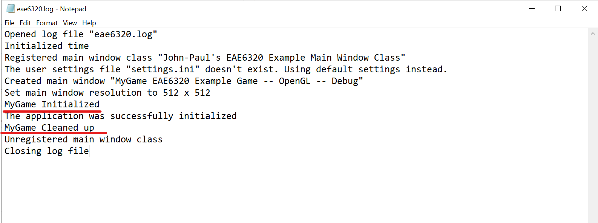

## Assignment 01 Write-up

### Downloads:
[MyGame_x86](https://github.com/XingnanChen/Engineer2/raw/master/MyGame_.zip)

### Assignment Objectives：
1. Learn about platform-specific and platform-independent implementation.
2. Encapsulate mesh and shader functions into classes.
3. Setup GPU debugger

### ScreenShots 
Animation  
  

Log Message  
  

### Implementation:
1. Create a mesh class and extract the mesh functions from graphics.[platform].cpp.  
    Taking graphics.d3d.cpp as example：
    a.Create a class called cMesh.There will be cMesh.h and cMesh.cpp. Change cMesh.cpp to cMesh.d3d.cpp.  
    b.Find Geometry Data in graphics.d3d.cpp and put those two variables into cMesh.d3d.cpp.  
    c.Find all the mesh functions(Draw&Initialize&Cleanup) and put them into cMesh.d3d.cpp.  

2. Create a shader class and extract the shader functions from graphics.[platform].cpp.(Bind&Initialize&Cleanup). Specific steps are the same as creating the mesh class.
3. Replace the code in graphics with mesh and shader class.
screenshot: draw&bind
4. Add another triangle to mesh.
5. GPU debugger
    a.Direct3D GPU capture
    b.OpenGL GPU capture

