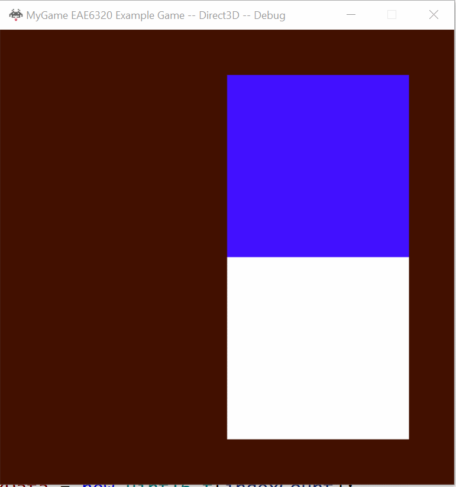

## Assignment 05 Write-up

### Downloads: 
//todo
[MyGame_x86](https://github.com/XingnanChen/Engineer2/blob/master/Assignment04/MyGame_OpenGL.zip?raw=true)  
[MyGame_x64](https://github.com/XingnanChen/Engineer2/blob/master/Assignment04/MyGame_D3D.zip?raw=true)


### Assignment Objectives：
- Represent a camera/object  
- Move the camera/object by changing the velocity when holding down the keys  
- Platform-Independent shaders  

### ScreenShots
Game Running  
  

//todo::
Show at least three screenshots (instead of separate screenshots you may also show a single animated GIF or video if you prefer):  
Show two with the object in a different place so that we can see it move around  
Show another one using a different mesh but in the same place as one of the previous screenshots so that we can see that the same object is being rendered with different geometry
//todo

 
### Implementation:  
Use object class as an example:  
1. Represent a camera/object  
- Create the object class:  
//todo put the object class code here  
```cpp  
```  
There are three member variables: m_mesh to save the object mesh data such as vertex data, m_effect to save the effect data such as shader data, and m_rigid_body to save the object physics data such as position and velocity.   
When we create a class. it’s easier for programmers to create new objects by using a class instead of changing arrays.  
We have to render the game frame by frame, so extrapolation on position of the object is necessary to draw the object precisely on each frame.  

- Change the logic in cMyGame and Graphics by using the object class  
//todo:put the code in mygame 
Show us your interface being used for submitting your game objects to be rendered  
(In other words, show us how you have decided to easily allow the game programmer to specify how an object should be rendered)  
I changed the interface from submitting meshdata and effectdata arrays to submitting the objects array, because I think it’s simple to iterate the data in Graphics and it’s clear for the gameplay programmer to understand the interface.  
//todo :  
Tell us how the size (in bytes) of the data that you need to store now for each draw call (how much memory does the graphics system need to cache in order to draw a mesh)?  
2. Move the camera/object by changing the velocity when holding down the keys  
There are some exist functions in the sRigidBodyState class to update the velocity or the position of objects. In order to change the    
3. Platform-Independent shaders  
Make DeclareConstantBuffer() and main() function to platform-independent in shaders.inc by using macro.
	//todo
	show the code in shaders.
 

