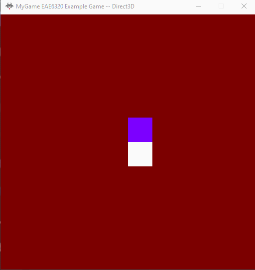

## Assignment 06 Write-up

### Downloads: 

[MyGame_x86](https://github.com/XingnanChen/Engineer2/blob/master/Assignment06/MyGame_x86.zip?raw=true)  
[MyGame_x64](https://github.com/XingnanChen/Engineer2/blob/master/Assignment06/MyGame_x64.zip?raw=true)


### Assignment Objectives：
- Using Lua to create a human-readable mesh file and loading the meshes.  

### ScreenShots
Game Running  
  

We can see from the gif the user can move the camera around by w,a,s,d and can control the above object with arrow keys.  
When user press F4. The mesh above will switch it's mesh from a square to a triangle.  

### Implementation:  
- Human-readable mesh file  
Many people perhaps have access to the asset files. Making asset files that are human-readable is to make it easy to create or edit by others.    
This is how I make my human-readable mesh file:  
```
return
{
	-- every three value in the vertexData array is a vertex data
	-- the vertex is in x, y, z order,
	vertexData = {
		0,	0,	0, 
		0.8,	0,	0, 
		0.8,	-0.8,	0, 
		0,	-0.8,	0
	},

	-- every three value in the indexData array are the vertex indexes of a triangle
	-- the vertices is in right-hand order,
	indexData = {
		0,	1,	2,
		0,	2,	3
	}
}
```  
说明为什么这个是readable的，并且为了readable做了哪些操作  

- Loading the meshes  
说明怎么loading的  
放debugging mesh builder的截图  
