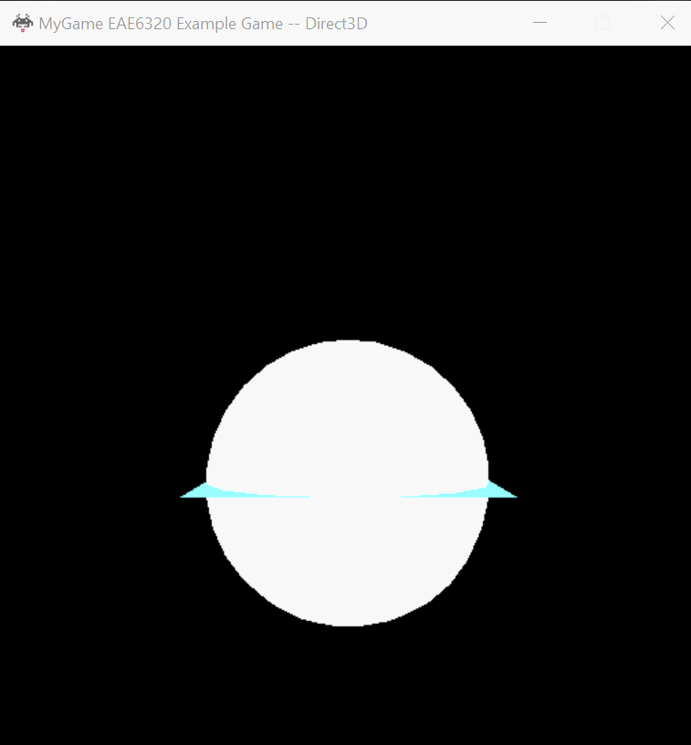
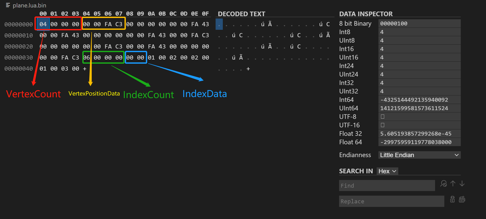

## Assignment 08 Write-up  

### Downloads: 

[MyGame_x86](https://github.com/XingnanChen/Engineer2/blob/master/Assignment08/MyGame_x86.zip?raw=true)  
[MyGame_x64](https://github.com/XingnanChen/Engineer2/blob/master/Assignment08/MyGame_x64.zip?raw=true)  

### ScreenShots  
This assignment is to build a binary mesh file to reduce the loading mesh time.
Game Running  
  

### Implementation:  
- Using .lua to generate a binary file in MeshBuilder.    
	The example of a binary geometry file built by MeshBuilder:   
   
	The order of the data is VertexCount, VertexPositionData, IndexCount, IndexData. The VertexCount should be written before VertexPositionData, and IndexCount should be written before IndexData. Since when we load from the binary file, we should know the size of the data in advance, or we won't know what the size should be initialized with.  
  
- Using binary file formats, we can save a lot of space on the disk. Comparing with the human-readable files, we only have data in the binary file. And using lua files will cost more time than binary files. 
	 
	 
	I created a Helix with 40780 vertices and 61140 indices, the binary takes 598 KB and the Lua file takes 1639 KB. It takes 0.002438 to load binary while 0.0510184 seconds to load the Lua file. From this simple benchmark, we can tell there is a huge advantage in using binary format at runtime. Binary only takes around 598 / 1639  = 35% space of the Lua file and 0.0510184 / 0.002438 = 20 times faster than Lua in loading.

	From this simple benchmark, we can tell there is a huge advantage in using binary format at runtime. Binary only takes around 598 / 1639  = 35% space of the Lua file and 0.0510184 / 0.002438 = 20 times faster than Lua in loading.


- Write and extract in binary
```cpp
outfile.write(reinterpret_cast<const char*>(&vertexCount), sizeof(uint32_t));
outfile.write(reinterpret_cast<const char*>(vertexData), sizeof(Graphics::VertexFormats::sVertex_mesh) * vertexCount);
outfile.write(reinterpret_cast<const char*>(&indexCount), sizeof(uint32_t));
outfile.write(reinterpret_cast<const char*>(indexData), sizeof(uint16_t) * indexCount);
```

These are the data I wrote to the binary file, we can tell vertexCount, indexCount and indexData are platform-independent since uint32_t and uint16_t are fixed size on every platform. sVertex_mesh is a struct with three float data. So if the float type in C++ is platform-independent, the output binary should be independent. But C++ standard never guarantees the size of the float would be the same on different platforms, though in practice nearly every mainstream platform (especially platforms for the game) implements float type under the IEE-754 standard which is 32 bit. But the standard is standard, we cannot say our output is completely platform-independent.  

And here is the code snippet I used to load data from the binary file, it's far easier than parsing with Lua.

```cpp
size_t curSize = sizeof(vertexCount);
auto currentOffset = reinterpret_cast<uintptr_t>(dataFromFile.data);

memcpy(&vertexCount, reinterpret_cast<void*>(currentOffset), curSize);
currentOffset += curSize;
newMesh->vertexCount = vertexCount;

newMesh->vertexData = new VertexFormats::sVertex_mesh[vertexCount];
curSize = sizeof(VertexFormats::sVertex_mesh) * vertexCount;
memcpy(newMesh->vertexData, reinterpret_cast<void*>(currentOffset), curSize);
currentOffset += curSize;

curSize = sizeof(indexCount);
memcpy(&indexCount, reinterpret_cast<void*>(currentOffset), curSize);
currentOffset += curSize;
newMesh->indexCount = indexCount;

newMesh->indexData = new uint16_t[indexCount];
curSize = sizeof(uint16_t) * indexCount;
memcpy(newMesh->indexData, reinterpret_cast<void*>(currentOffset), curSize);
```

