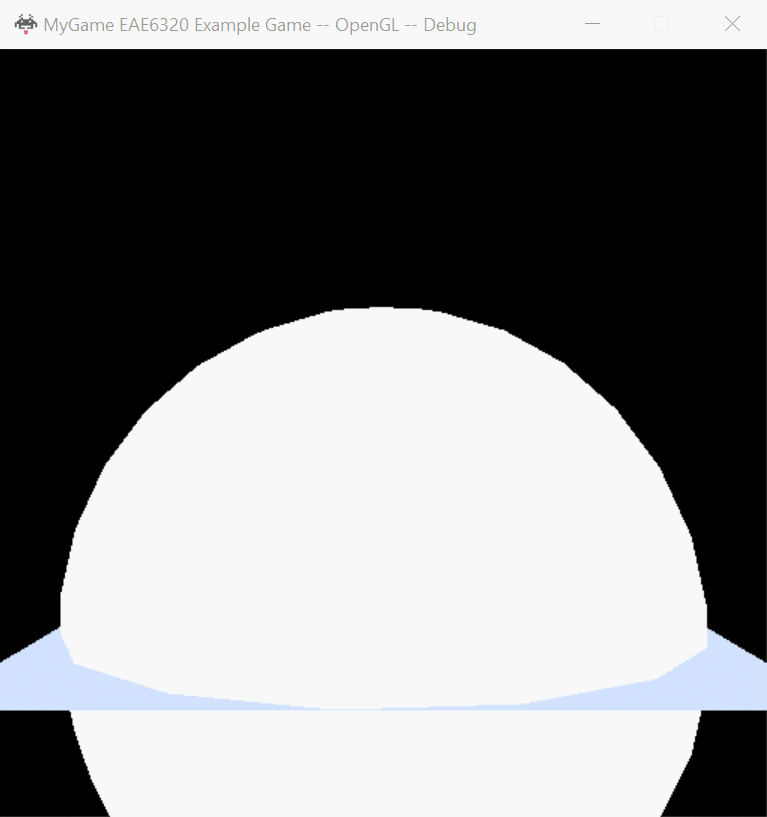
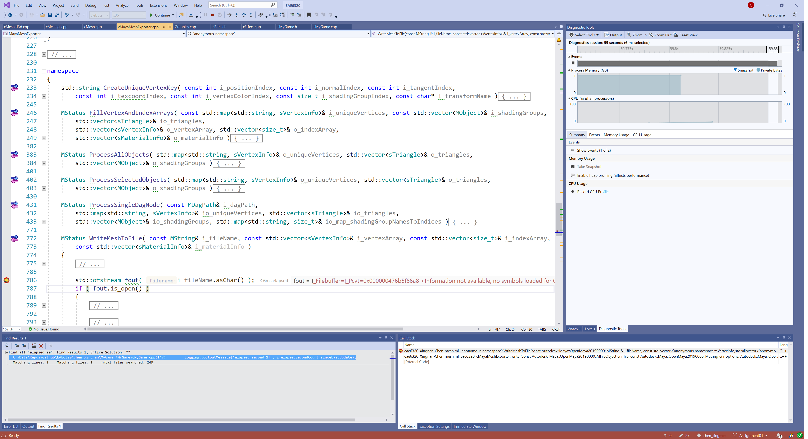

## Assignment 07 Write-up  

### Downloads: 

[MyGame_x86](https://github.com/XingnanChen/Engineer2/blob/master/Assignment07/MyGame_x86.zip?raw=true)  
[MyGame_x64](https://github.com/XingnanChen/Engineer2/blob/master/Assignment07/MyGame_x64.zip?raw=true)  

### ScreenShots  
Game Running  
  

### Implementation:  
- Install Maya and attach Maya to Visual Studio.  
Install Maya and set environment variables to tell Maya the location of plugins and devkit. Add MayaMeshExporter project into Visual Studio and add the references. Build the project, then Maya can use the plugins from Visual Studio. Attach Maya to Visual Studio, then those plugins can be debugged in Visual Studio when we use Maya.  

Screenshot of bebugging plug-in  
  

- Create meshes by Maya and use them in Visual Studio.  
Create the meshes in Maya and then export them in my project. I didn't exported the unused data because there is no need to use those data in this assignment. I only need the vertex data and index data to render the meshes.  
When I tried to load a model with too many vertices, it took a long time but didn't crash. And I think the best way to overcome this problem is to add extra information to the mesh lua file. For example, the first line is commented number of vertices and the mesh loader will parse the commented line to check if the number of vertices is less than the system limit. 
