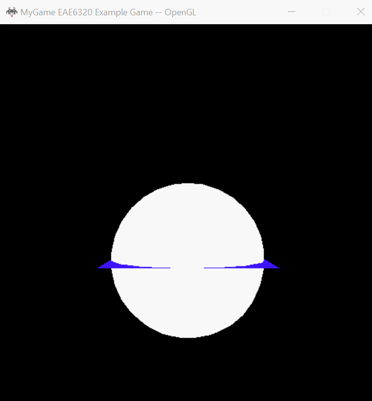
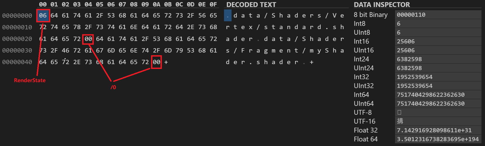

## Assignment 09 Write-up  

### Downloads: 

[MyGame_x86](https://github.com/XingnanChen/Engineer2/blob/master/Assignment09/MyGame_x86.zip?raw=true)  
[MyGame_x64](https://github.com/XingnanChen/Engineer2/blob/master/Assignment09/MyGame_x64.zip?raw=true)  

### ScreenShots  
Game Running  
  

### Implementation:  
This assignment is to create human readable effect lua file and build a binary effect file from this lua file to improve the performance.  

- Create a human readable effect lua file: 
```lua  
return
{
	vertexShaderPath = "Shaders/Vertex/standard.shader",
	fragmentShaderPath = "Shaders/Fragment/myShader.shader",
	renderState =
	{
		AlphaTransparency = "false",
		DepthTesting = "true",
		DepthWriting = "true",
		DrawBothTriangleSides = "false"
	}
}
```  

- Build binary file from lua  
binary file:  
  

Because there already have some method(null-termination) to find the paths(string type), we don't need to add the string length before each path. So the structure of my binary file was render_state_bits(2 bytes) + first_path(36 bytes) + second_path(38 bytes).
I added the prefix "data\" to the path in EffectBuilder. It decreases run-time cost while increases file size. In context of performance, whether we add the prefix at run-time or build-time there are advantages and disadvantages. So I focus more on the semantics of the data. This piece of data in binary file stands for "path of shader file at runtime", so it's more reasonable to consider the path in runtime's environment, which is relative to $(GameInstallDir).

-load the data from binary file in run-time  
```cpp
	std::string vertex_shader_path, fragment_shader_path;
	uint8_t render_state_bits;
	auto currentOffset = reinterpret_cast<uintptr_t>(dataFromFile.data);

	memcpy(&render_state_bits, reinterpret_cast<void>(currentOffset), sizeof(render_state_bits));

	currentOffset += sizeof(render_state_bits);

	vertex_shader_path = reinterpret_cast<char>(currentOffset);
	currentOffset += vertex_shader_path.size() + 1;

	fragment_shader_path = reinterpret_cast<char*>(currentOffset);
```  

According to the structure of my binary file, I calculated the size of render state first. The byte next to the the render_state_bits was the start of the first path. I could extract the first path with the *string& operator= (const char\* s)* to get string from *char\**. Then I added first path's length( vertex_shader_path.size() + 1) to offset to calculate the start position of the second path. 


