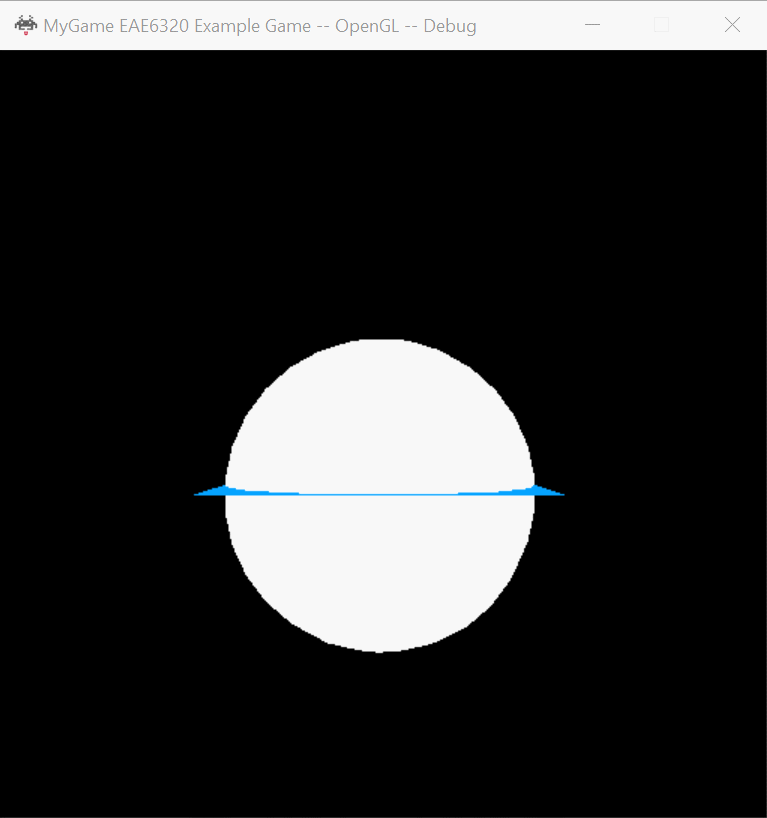
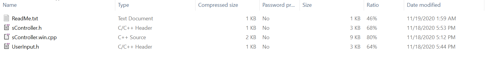
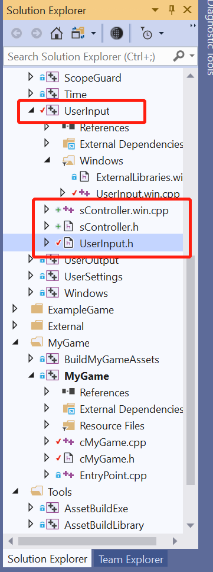

# Engine System: Controller  

My engine system is to make a game controller engine and make it easy for users to get the inputs from different devices such as keyboard, mouse and gamepad, so that users can control the objects easily.  

## Downloads:  
[ControllerEngine](https://github.com/XingnanChen/Engineer2/blob/master/Engine/UserInput.zip?raw=true)  

## Game running:  
  

## How to Use  
If you want to use my project, you need download zip I shared in this page. There are four files in this zip.  
  

Then you should:  
- Add sController.h into UserInput project;  
- Add sController.win.cpp into UserInput project;  
- Update UserInput.h in the UserInput project with UserInput.h  
Now your UserInput project will look like this:  
  

### UserInput.h
In UserInput.h, I use the enum to present the key codes.  
```cpp
enum eKeyCodes
{
    Left = 0x25,
    Up = 0x26,
    Right = 0x27,
    Down = 0x28,
    Space = 0x20,
    Escape = 0x1b,
    Shift = 0x10,
    Control = 0x11,
    Alt = 0x12,
    Tab = 0x09,
    CapsLock = 0x14,
    BackSpace = 0x08,
    Enter = 0x0d,
    Delete = 0x2e,
    PageUp = 0x21,
    PageDown = 0x22,
    End = 0x23,
    Home = 0x24,
    F1 = 0x70,
    F2 = 0x71,
    F3 = 0x72,
    F4 = 0x73,
    F5 = 0x74,
    F6 = 0x75,
    F7 = 0x76,
    F8 = 0x77,
    F9 = 0x78,
    F10 = 0x79,
    F11 = 0x7a,
    F12 = 0x7b,
    MouseLButton = 0x01,
    MouseRButton = 0x02,
};

enum eGamepadKeyCodes
{
    A = 0x1000,
    B = 0x2000,
    X = 0x4000,
    Y = 0x8000,
    UP = 0x0001,
    DOWN = 0x0002,
    LEFT = 0x0004,
    RIGHT = 0x0008,
    START = 0x0010,
    BACK = 0x0020,
    LTHUMB = 0x0040,
    RTHUMB = 0x0080,
    LS = 0x0100,
    RS = 0x0200
};

enum eGamepadAxis
{
    GamepadLX,
    GamepadLY,
    GamepadRX,
    GamepadRY
};
```  
Those enum values are the same as they are in windows, but any platform could use those enums. A different platform would translate them in UserInput.win.cpp.  

### sController.h&sController.win.cpp
In sController.h, I create a struct called sController. There are four public interfaces and one static member that you need if you want to use this system.  
```cpp
//BindActions are for key pressed and released
//i_key		: the input key representation, the values are the same as they are in the windows 
//i_inputEvent	: the key event representation, it only support two events now, e_pressed means key is pressed, e_released means the first time the key is released.
//i_callback	: the callback function that will bind to the key.
void BindActions(uint_fast8_t i_key, eInputEvent i_inputEvent, std::function<void()> callback);
void BindActions(UserInput::KeyCodes::eGamepadKeyCodes i_key, eInputEvent i_inputEvent, std::function<void()> callback);

//BindAxis allow for inputs that have a continuous range
//i_key		: the input axis representation
//i_callback	: the callback function that will bind to the axis.
void BindAxis(UserInput::KeyCodes::eGamepadAxis i_key, std::function<void(float)> callback);

//detect input and call the bind function
void TriggerActions();

//a static memeber, it is shared by all objects of the class. All static data is initialized to zero when the first object is created
static sController g_controller;
```  
To make an easy-to-use interface, I made two bind functions to bind the user-defined fuction to input keys. BindAction are for key presses and releases, while BindAxis allow for inputs that have a continuous range.  

I use XInput to receive input from the Xbox Controller for Windows. All implementation are in sController.win.cpp in order to make it platform-independent.  

## Usage Example  
Here is an expamle that how to use the Controller system:  
```cpp
//in cMyGame.h
//Add header
#include "Engine/UserInput/sController.h"

//Add a member into class
class cMyGame final : public Application::iApplication
{
  //...
  sController& gController = sController::g_controller;
  //...
}

//In cMyGame.cpp
//Add header
#include <Engine/UserInput/UserInput.h>

  //Use the interfaces to bind functions to keys or axis. I put this in Initialize().
void eae6320::cResult eae6320::cMyGame::Initialize()
{
  //bind to keyboard keys
	gController.BindActions(UserInput::KeyCodes::F2,e_pressed, [&]() { meshCount = 1; });
	gController.BindActions(UserInput::KeyCodes::F3, e_pressed, [&]() { m_gameObjects[0].changeEffect(effect_c); });
	gController.BindActions(UserInput::KeyCodes::F4, e_pressed, [&]() { m_gameObjects[0].changeEffect(effect_c); });

	gController.BindActions(UserInput::KeyCodes::Left, e_pressed, [&]() { objectMoveLeft = -1.f; });
	gController.BindActions(UserInput::KeyCodes::Right, e_pressed, [&]() { objectMoveLeft = 1.f; });
	gController.BindActions(UserInput::KeyCodes::Down, e_pressed, [&]() { objectMoveUp = -1.f; });
	gController.BindActions(UserInput::KeyCodes::Up, e_pressed, [&]() { objectMoveUp = 1.f; });

	gController.BindActions('W', e_pressed, [&]() { cameraMoveUp = 1.f; });
	gController.BindActions('A', e_pressed, [&]() { cameraMoveLeft = -1.f; });
	gController.BindActions('D', e_pressed, [&]() { cameraMoveLeft = 1.f; });
	gController.BindActions('S', e_pressed, [&]() { cameraMoveUp = -1.f; });
	
	gController.BindActions('A', e_released, [&]() { cameraMoveLeft = 0.f; });
	gController.BindActions('D', e_released, [&]() { cameraMoveLeft = 0.f; });
	gController.BindActions('S', e_released, [&]() { cameraMoveUp = 0.f; });
	gController.BindActions('W', e_released, [&]() { cameraMoveUp = 0.f; });

	
	gController.BindActions(UserInput::KeyCodes::Left, e_released, [&]() { objectMoveLeft = 0; });
	gController.BindActions(UserInput::KeyCodes::Right, e_released, [&]() { objectMoveLeft = 0; });
	gController.BindActions(UserInput::KeyCodes::Down, e_released, [&]() { objectMoveUp = 0; });
	gController.BindActions(UserInput::KeyCodes::Up, e_released, [&]() { objectMoveUp = 0; });

	//bind to mouse
	gController.BindActions(UserInput::KeyCodes::MouseLButton, e_pressed, [&]() { cameraMoveUp = 1.f; });
	gController.BindActions(UserInput::KeyCodes::MouseLButton, e_released, [&]() { cameraMoveUp = 0.f; });

	//bind to gamepad button input
	gController.BindActions(UserInput::KeyCodes::A, e_pressed, [&]() { cameraMoveUp = -1.f; });
	gController.BindActions(UserInput::KeyCodes::A, e_released, [&]() { cameraMoveUp = 0.f; });

	gController.BindActions(UserInput::KeyCodes::Y, e_pressed, [&]() { cameraMoveUp = 1.f; });
	gController.BindActions(UserInput::KeyCodes::Y, e_released, [&]() { cameraMoveUp = 0.f; });

	gController.BindActions(UserInput::KeyCodes::X, e_pressed, [&]() { cameraMoveLeft = -1.f; });
	gController.BindActions(UserInput::KeyCodes::X, e_released, [&]() { cameraMoveLeft = 0.f; });

	gController.BindActions(UserInput::KeyCodes::B, e_pressed, [&]() { cameraMoveLeft = 1.f; });
	gController.BindActions(UserInput::KeyCodes::B, e_released, [&]() { cameraMoveLeft = 0.f; });

	//bind to gamepad axis
	gController.BindAxis(UserInput::KeyCodes::GamepadLX, [&](float i) {objectMoveLeft = i; });
	gController.BindAxis(UserInput::KeyCodes::GamepadLY, [&](float i) {objectMoveUp = i; });
  
  //...
}

//Add the trigger function to dectect the input every update.
void eae6320::cMyGame::UpdateSimulationBasedOnInput()
{
	//Every update, if detect input from devices, call the corresponding function
	gController.TriggerActions();
  
	float speed = 100;
  //the value of cameraMoveLeft, cameraMoveUp, objectMoveLeft, ojectMoveUp will be changed by the call back function if the binding key is triggered.
	m_camera.m_rigidbody.velocity = { cameraMoveLeft * speed, cameraMoveUp * speed, 0 };
	m_gameObjects[0].m_rigidbody.velocity = { objectMoveLeft * speed, objectMoveUp * speed, 0 };
}
