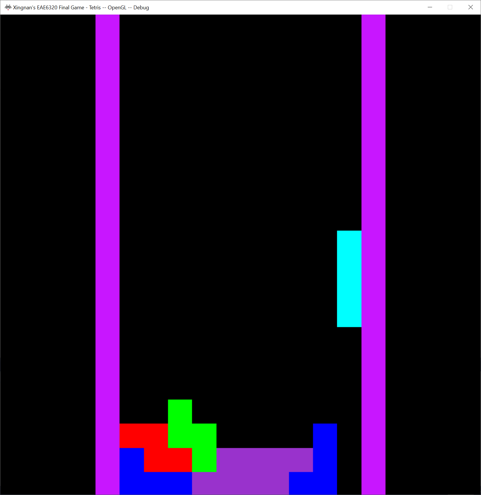

## Final Game Write-up  

### Downloads: 

[FinalGame_x86](https://github.com/XingnanChen/Engineer2/blob/master/FinalGame/Tetris_x86.zip?raw=true)  
[FinalGame_x64](https://github.com/XingnanChen/Engineer2/blob/master/FinalGame/Tetris_x64.zip?raw=true)  

### ScreenShots  
Game Running  
  

### Final Project:  
I played a lot of Tetris 99 on Nintendo Switch recently, so I decided to make a Tetris game.  
 
I added my Controller Engine to bind functions to the inputs from the keyboard and the Xbox controller. I didn’t provide the human-readable action mapping data as UE4 did because the gameplay engineers still need to bind the functions to the actions in the game as we don’t have an editor.  
 
I also used Yuhan’s Audio Engine to add some sound effects such as background music. Her engine is easy to use. The format of the data file is human-readable with the name and the comments. And the interfaces are user-friendly so that I used her engine in my game quickly.  
 
The lines which are filled with game objects will be cleared. I need to delete the objects and make them not render anymore. In order to make my game objects are easy to be deleted, I change the interface from 
```cpp SubmitMeshAndEffect(GameObject* i_game_objects, size_t i_count) ``` 
to 
```cpp SubmitMeshAndEffect(const std::list<GameObject> &i_game_objects); ``` in Graphic Engine. The time complexity of the list.remove() is o(n).  
 
### Semester Summary  
 
The goal of the assignments is to learn to make an easy-maintain engine with user-friendly and platform-independent interfaces and provide human-readable asset files.   
 
In this class, I learned what is the platform-independent and platform-specific interfaces. This is the first time for me to consider the different platforms. As an engine engineer, we need to provide one definition of one interface and the declaration of the interface could be different depends on the platform. What's more, I learned how to use the reference count. Finding Where the reference count should be add 1 or minus 1 cost me lots of time. I also learned how to create a human-readable lua file and change it to the binary files which can be loaded at run-time. I also could export the models in Maya to my lua format file which is interesting.  

After finishing all the assignments, I found that design is really important for engine engineers. There are many things that need to be considered before we write codes such as the platform. And the interfaces from the engine should be easy to use. In the final game project, the interface ```cpp SubmitMeshAndEffect(GameObject* i_game_objects, size_t i_count) ``` I mentioned before is not satisfied my need. The first parameter is the array data structure which is difficult to delete data. So I changed it to the list data structure to fit my request. A good engine should satisfy all the requirements that users perhaps need. The array is easy to find data, the list is easy to delete. So the engine could provide two or more interfaces that users can select by their requirement.  

As an engineer, we should design the user-friendly, platform-independent, stable, and maintainable software. We can't write the code that only the writer knows how to use it.
 

